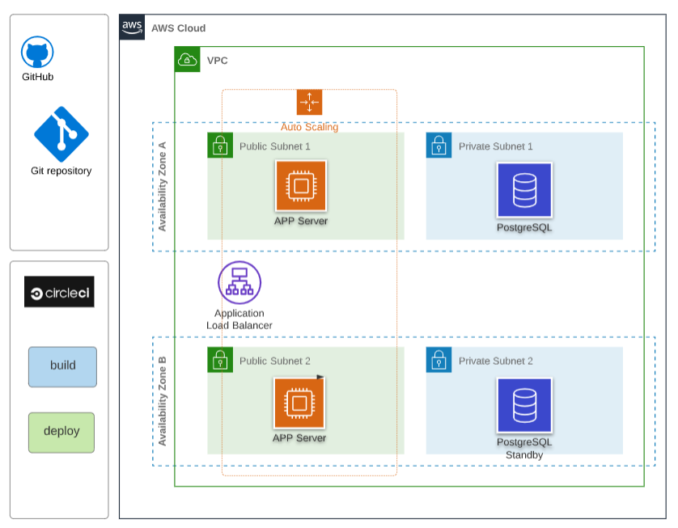
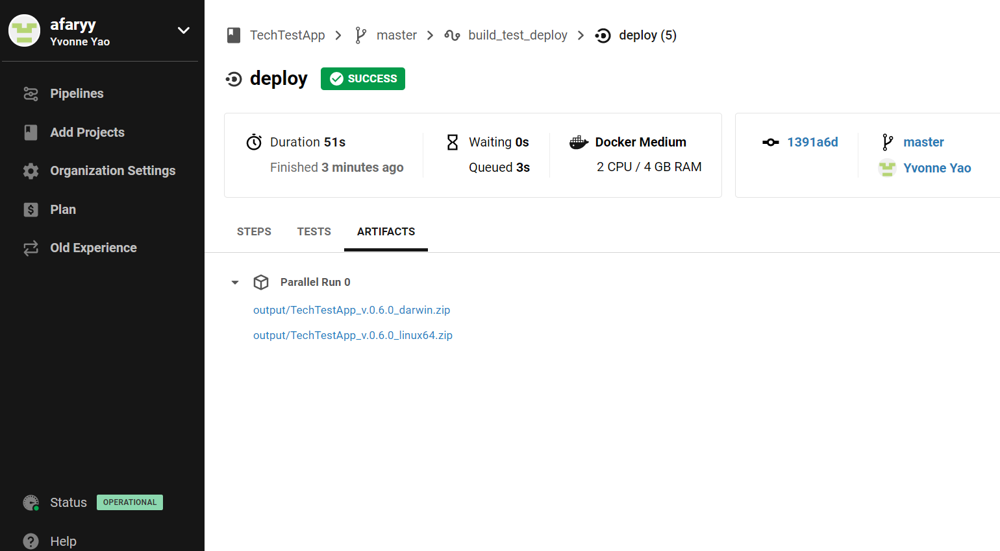
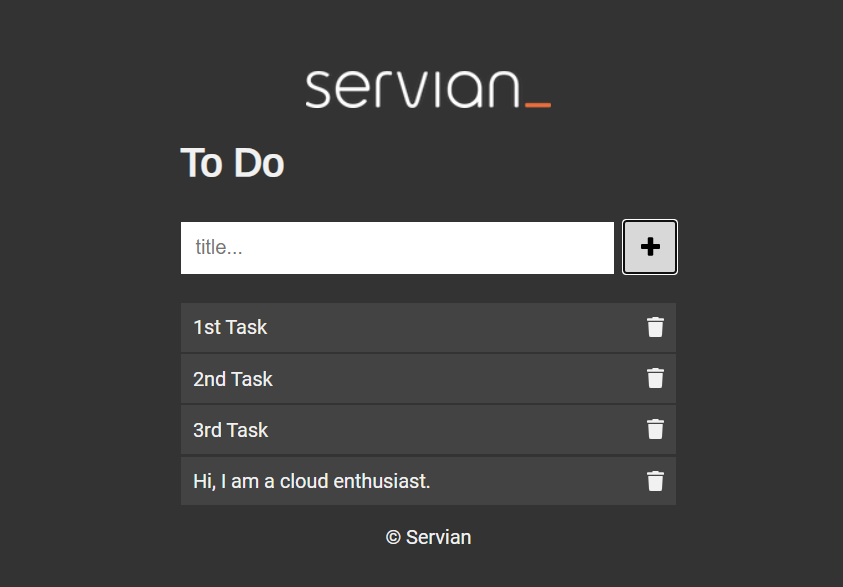

# Deploy TechTestApp on AWS Cloud

## Overview
This solution is focused on how to deplpoy the Servian TechTestApp to AWS cloud based on skills such as Github, circleci, docker, AWS EC2, RDS, VPC, ALB, ASG.

References: [readme-serviantechtest file](readme-serviantechtest.md)    [assessment.md file](ASSESSMENT.md)


## Pre requisites for your deployment


- Login to AWS Management Console and Generate a new KeyPair. Save the downloaded key
- Configure AWS CLI with a new AWS Access Key and a secret generated on AWS
- Create EC2 instance and use SSH to connect it
- Install git, docker, golang/dep(if compile from source) on EC2
- Create/Login a Github account, generate an SSH key on EC2 and add the SSH key to GH account
- On EC2, clone git repo from github and unzip into desired location ./gocode
- Create CircleCi account connecting with github repo, also need add ssh key.

## Deployment Architecture



- To achieve High Availability in AWS, it is recommended to run services across multiple Availability Zones by using AWS services such as Load Balancers, and deploying Amazon EC2 instances in multiple Availability Zones.

- To achieve front end auto scaling, create Amazon EC2 Auto Scaling Group to launch or terminate APP instances automatically based on user-defined policies, schedules, and health checks, and automatically distributes instances across multiple Availability Zones to make applications Highly Available.

- For database Highly Available, configuring ProstgreSQL database instances to run across multiple Availability Zones. One instance is the Master, which is handling all requests. Another instance will be launched as the Secondary instance, which will take over in case the Master fails.  Enable Storage autoscaling to allow the storage to increase once the specified threshold is exceeded.

- To deploy secure infrastructure in AWS,  define Security Groups for  Application Load balancer(ALB) , EC2 and RDS database instance. ALB accept all incoming HTTP and HTTPS requests from Internet, the Application security group only accept incoming traffic from the load balancer. The Database security group only accept incoming traffic from the application servers.

- To automation secure infrastructure in AWS,  define Security Groups for  Application Load balancer(ALB) , EC2 and RDS database instance. ALB accept all incoming HTTP and HTTPS requests from Internet, the Application security group only accept incoming traffic from the load balancer. The Database security group only accept incoming traffic from the application servers.

- To realize automated deployment, use github and circleci to automate code commits, builds,tests, deployments and version control, also use few linux commands/shell scripting.

- For considering Simplicity, deploy app on a EC2 instance, and make a image from it for further front end auto scaling group. Three methods for deploy app on EC2: (1) clone github repo, compile source code, then build and deploy app on EC2; (2) clone github repo, use docker to bulid image from dockerfile and run container on EC2; (3) Use CircleCI connecting Github to  


## Deployment Process

### 1. Create Postgresql database by AWS RDS

Create Postgresql Database instance by using RDS.

update `conf.toml` with defined database settings

```yml
"DbUser" = "postgres"
"DbPassword" = "1234qwer"
"DbName" = "app"
"DbPort" = "5432"
"DbHost" = "docker-test.cy77eloe52fd.ap-southeast-2.rds.amazonaws.com"
"ListenHost" = "0.0.0.0"
"ListenPort" = "80"

```

### 2. Build, test and deploy APP

#### 2.1 Deploy from the source code on EC2


Start sever by ` start.sh` file

```bash
#!/bin.bash
# create a database and seed it with test data
./TechTestApp updatedb -s
pid=`ps -ef|grep TechTestApp|grep -v "grep"`
kill $pid
# start serving requests
nohup ./TechTestApp serve &

```
#### 2.2 Deploy from Dockerfile on EC2
update `conf.toml` with database settings

```yml
"DbUser" = "postgres"
"DbPassword" = "1234qwer"
"DbName" = "app"
"DbPort" = "5432"
"DbHost" = "docker-test.cy77eloe52fd.ap-southeast-2.rds.amazonaws.com"
"ListenHost" = "0.0.0.0"
"ListenPort" = "3000"

```

Build docker image and run container

```
# build docker images
docker build . -t techtestapp:latest 
# run docker container service
docker run -d -p 3000:3000 techtestapp serve
```
#### 2.3 Automated build, test, deploy on CircleCI Plateform
On CircleCi Platform, use the pipeline to build, test and deploy APP based on .circleci/config.yml





Download artifacts after successfully deploy using the URL
```
https://5-270295100-gh.circle-artifacts.com/0/output/TechTestApp_v.0.6.0_linux64.zip
```
Or 

Automated download the latest release to EC2 desired directory.
``` bash 

#!/usr/bin/env bash

user=ec2-user
host=54.66.230.45
src=`pwd`"/"
des=/opt/gocode
now=`date +"%Y-%m-%d %H:%M:%S"`

rsync -vzrc --delete  --exclude ".git"  --exclude ".env"   --exclude ".circleci"   $src  $user@$host:$des

ssh $user@$host "sudo chown -R ec2-user:ec2-user $des"

echo "$now update $host $des code"

```

Start the server by execute the command sh start.sh.
```
#!/bin.bash

./TechTestApp updatedb -s
pid=`ps -ef|grep TechTestApp|grep -v "grep"`
kill $pid
nohup ./TechTestApp serve &
```
### 3. Improved deployment on AWS

- Create Image from EC2 embeddend deployed app
- Create APP security group and Database security group
- Create two public subnets and two private subnets in 2 AZ
- Create an application load balancer and ALB security group
- Create an auto scaling group
- Edit PostgreSQL instance and enable Multi-AZ deployment and Storage autoscaling (not be required for a simple APP)


## check endpoints status

- http://54.66.230.45/   --load the SPA to create, delete tasks



- http://54.66.230.45//api/tasks/ --404 page not found, because the relative code is commented out.
- http://54.66.230.45/healthcheck/ --result: 0k


## Conclusion
Based on a technical test assessment requirement -Simplicity, I try to use a quick, simple and cheap deployment solution, instead of other solutions like ECS/EKS on AWS or other cloud platforms like Azure and GCP. I really enjoyed the deployment process of unknown application. I have learned a lot from this case. Thanks.


